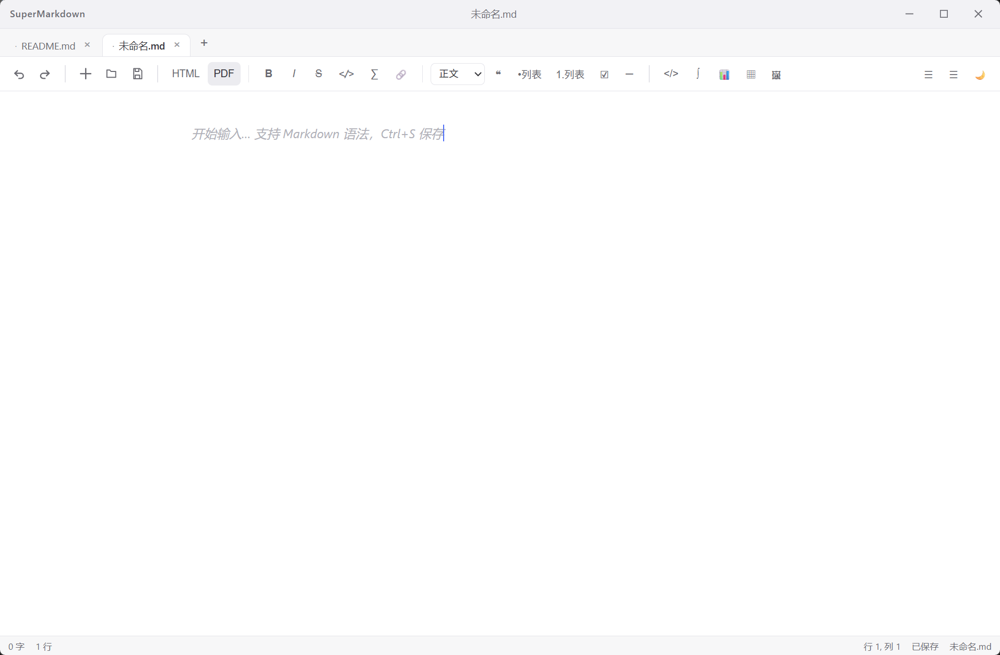
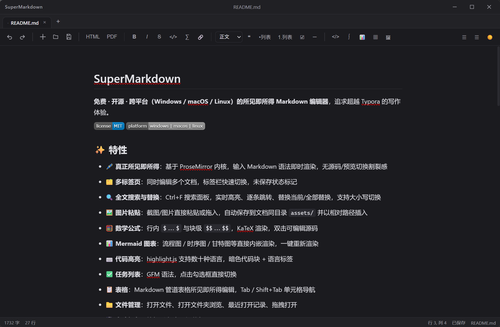
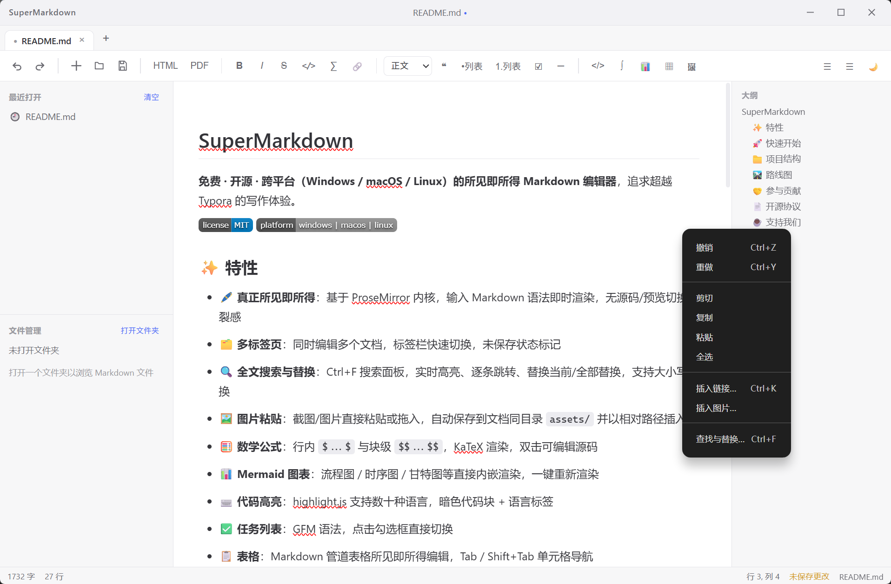
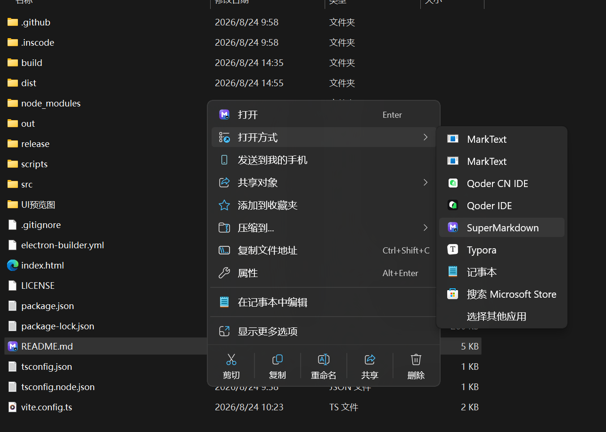
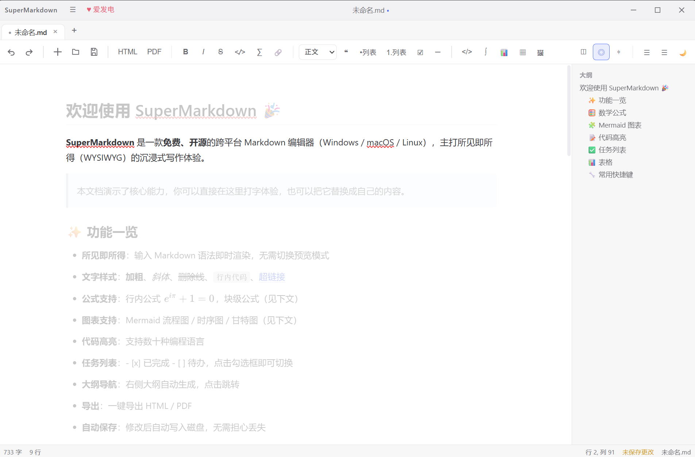
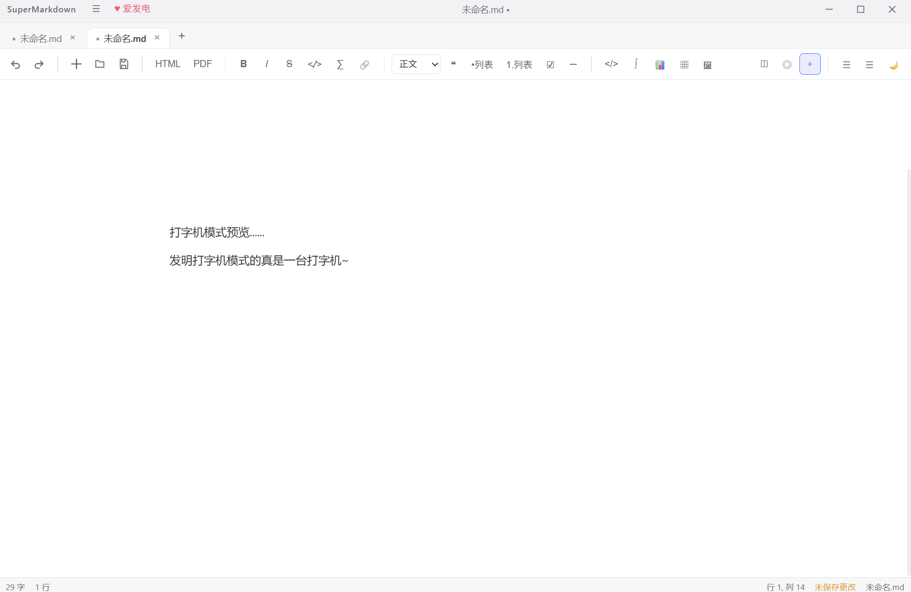

# 超越 Typora？我用 Electron + ProseMirror 开源了一款所见即所得 Markdown 编辑器：SuperMarkdown 技术内幕

> **SuperMarkdown** — 免费 · 开源 · 跨平台（Windows / macOS / Linux）的所见即所得 Markdown 编辑器，MIT 协议，已在 GitCode 开源：[GreenHands495/SuperMarkdown](https://gitcode.com/GreenHands495/SuperMarkdown)

 

如果你也经历过 Typora 收费后的纠结、VS Code 写 Markdown 的割裂感，或是 Notion 离线不可用的无奈，这篇文章也许能给你一个新的选择——以及一份从 0 到 1 打造桌面 Markdown 编辑器的完整技术复盘。

## 一、为什么还要再做一个 Markdown 编辑器？

Markdown 编辑器早已红海，但痛点依然清晰：

1. **Typora 收费且闭源**：1.0 后 89 元买断，定制与二次开发无门。
2. **所见即所得的缺失**：VS Code + 插件是“源码 + 预览”双栏，写作心流被打断；Slate/TipTap 类编辑器易用，但 Markdown 还原度差。
3. **跨平台与离线**：Web 版依赖网络，桌面版又往往只顾 Windows。

SuperMarkdown 的目标很直接：**做一个真正开源、离线可用、所见即所得、体验对标 Typora 的编辑器**，并把所有技术细节开放出来。

   

---

## 二、技术选型：为什么是 Electron + ProseMirror？

### 编辑器内核：ProseMirror 而非 CodeMirror / Monaco / Slate

| 方案 | 定位 | Markdown 能力 | 所见即所得 | 扩展性 |
|---|---|---|---|---|
| CodeMirror/Monaco | 代码编辑器 | 强（文本） | 弱 | 中 |
| Slate / TipTap | 富文本 | 需大量转译 | 强 | 强 |
| ProseMirror | 结构化文档编辑器 | 需自建 Schema | 极强 | 极强 |

ProseMirror 的核心是 **Schema 定义的文档模型** + **Transaction 驱动的状态机**，而非简单的 contenteditable。它天生适合“Markdown ↔ 文档树 ↔ 视图”的三角转换，且对表格、数学公式、自定义 NodeView 的支持远超 Slate。

### 桌面壳：Electron 而非 Tauri

Tauri 体积小，但 SuperMarkdown 需要深度系统集成：文件关联、右键“用 SuperMarkdown 打开”、NSIS 安装时写注册表、单实例与命令行参数透传。Electron 的生态与 `electron-builder` 的成熟度在此场景下仍是首选。

最终栈：**Electron 37 + React 19 + ProseMirror + Zustand + esbuild/vite**

```
src/
├── main/            # 主进程：窗口、菜单、文件/导出 IPC、单实例
├── preload/         # contextBridge 暴露 api
└── renderer/        # 渲染进程
    ├── editor/      # ProseMirror 内核
    │   ├── schema.ts      # 文档模型
    │   ├── parser.ts      # Markdown → 文档
    │   ├── serializer.ts  # 文档 → Markdown
    │   ├── nodeviews.ts   # 代码块/公式/图片 视图
    │   ├── plugins.ts     # 快捷键/输入规则
    │   └── export.ts      # HTML/PDF 导出
    └── store.ts     # Zustand 全局状态
```

---

## 三、架构总览：三层隔离与单向数据流

```
主进程 (Node)  ←→  preload (contextBridge)  ←→  渲染进程 (React + ProseMirror)
   │   文件读写/对话框/菜单/单实例               │  Zustand + EditorView
```

* **主进程** `src/main/index.ts:30` 创建 `BrowserWindow`，注册 `ipcMain.handle('file:read')` 等 10+ 通道，处理单实例 `app.requestSingleInstanceLock()` 与 `second-instance` 转发。
* **Preload** `src/preload/index.ts:1` 仅暴露白名单 `api`，开启 `contextIsolation: true`。
* **渲染进程** `src/renderer/store.ts:55` 用 Zustand 管理标签页、主题、大纲、搜索状态；`EditorView` 实例按 tabId 缓存于 `views` 字典，切换标签仅显隐 DOM 而非重建状态。

这一分层让“文件系统”与“编辑体验”彻底解耦，也让后续的右键菜单、文件关联等系统特性易于扩展。

---

## 四、八个核心难题与解法

### 1\. Schema 设计：让 Markdown 长出“富文档”的骨骼

`src/renderer/editor/schema.ts` 定义了完整的文档模型，远超 CommonMark：

```ts
nodes: {
  doc, paragraph, heading, blockquote, code_block,  // 基础
  math_inline, math_block,                           // KaTeX 双击编辑
  image, table, table_cell, task_item               // GFM 任务列表
}
marks: { strong, em, s, code, link }
```

关键是在 `marks` 与 `nodes` 的 `parseMarkdown` / `toMarkdown` 中保持**可逆性**：任何一次编辑后 `serializer` 产出的 Markdown 再 `parser` 回来，文档树必须一致。我们为 `math_inline` 等节点设计了 `content: string` 属性而非子文本，避免光标误入源码。

### 2\. 解析与序列化：markdown-it 与 ProseMirror 的桥接

`parser.ts` 用 `markdown-it` + 自定义 token 规则将 Markdown 转为 ProseMirror 文档；`serializer.ts` 则遍历 `doc.descendants` 逆向拼接。难点在于**管道表格与任务列表**：markdown-it 默认不支持 GFM 任务列表的 `checked` 属性，我们通过 `token.attrGet('checked')` 注入到 `task_item` 节点的 `checked` attr，并在序列化时还原为 `- \[x\]`。

### 3\. 所见即所得：NodeView 的魔法

`src/renderer/editor/nodeviews.ts` 为代码块、数学公式、Mermaid 图表提供了 NodeView：

* **KaTeX 块**：`katex.renderToString` 渲染为静态 DOM，双击时 `openModal({ kind: 'math', pos, initial })` 弹出源码编辑，提交后 `tr.setNodeMarkup` 更新。
* **Mermaid**：同理，`mermaid.render` 后注入 SVG，重渲染按钮一键刷新。
* **表格单元格导航**：`src/renderer/editor/plugins.ts:46` 的 `tableNav()` 插件拦截 `Tab / Shift+Tab`，在 `table → row → cell` 三级结构中计算 `cellPos + offset` 实现光标跨单元格跳转。

这种“静态渲染 + 模态编辑”的混合模式，兼顾了 WYSIWYG 的流畅与源码的可控。

### 4\. 撤销/重做：一次与 Electron 菜单的“冲突”

这是最隐蔽的坑。最初菜单用 `role: 'undo' / 'redo'`（`src/main/menu.ts:52` 旧版）：

```ts
{ role: 'undo', label: '撤销' },
{ role: 'redo', label: '重做' },
```

这会走 Electron 的原生 `webContents.undo()`（Chromium 的 `execCommand('undo')`），而 ProseMirror 的历史由 `prosemirror-history` 自管，原生撤销对其**完全无效**，且菜单加速器会拦截 `Ctrl+Z` 导致 keymap 收不到事件。

**修复**（`src/main/menu.ts:52` 新版 + `src/renderer/editor/plugins.ts:123`）：

```ts
// menu.ts：改为自定义 action，保留快捷键显示
{ label: '撤销', accelerator: 'CmdOrCtrl+Z', click: () => send('undo') },
{ label: '重做', accelerator: isMac ? 'Shift+CmdOrCtrl+Z' : 'CmdOrCtrl+Y', click: () => send('redo') },

// plugins.ts：keymap 兜底（浏览器预览模式）
keymap({ 'Mod-z': undo, 'Shift-Mod-z': redo, 'Mod-y': redo }),

// App.tsx：渲染进程执行 ProseMirror 历史命令
;(action === 'undo' ? undoHist : redoHist)(view.state, view.dispatch)
```

教训：**永远不要让 Electron 的原生编辑角色去操作 ProseMirror 文档**。

### 5\. 右键菜单：从“没有”到“完整”

最初版本没有右键菜单。我们构建了两套菜单：

* **编辑器内右键**：`src/main/menu.ts:97` 的 `showContextMenu(win)`，含撤销/重做/剪切/复制/粘贴/全选/插入链接/图片/查找。通过 `ipcRenderer.send('context-menu:show')` 由渲染进程的 `window.addEventListener('contextmenu')` 触发。
* **系统文件右键**：`build/installer.nsh` 在 NSIS 安装时写入 `HKCR\\SystemFileAssociations\\.md\\shell\\SuperMarkdown`，实现“用 SuperMarkdown 打开”；配合 `src/main/index.ts:12` 的 `extractOpenFilePath(argv)` 与 `second-instance` 转发，已运行实例也能接收新文件。

无边框窗口下原生菜单栏默认隐藏（需按 `Alt`），我们还在 `src/renderer/components/TitleBar.tsx:35` 新增了常驻的 **☰ 菜单** 与 **♥ 爱发电** 按钮，前者 `api.popAppMenu()` 弹出应用菜单，后者直达 `https://afdian.com/a/csqk495`。

### 6\. 图片粘贴：相对路径与自动归档

`src/renderer/editor/commands.ts:160` 的 `handleEditorPaste` / `handleEditorDrop` 拦截 `dataTransfer` 中的图片，`api.imageSave(dataUrl, dir)` 在主进程将 `data:image/...;base64,...` 解码写入 `path.join(dir, 'assets', name)`，返回相对路径 `assets/img-xxx.png` 插入文档。彻底避免了绝对路径导致的外发失效。

### 7\. 搜索与高亮：Decoration 的艺术

`src/renderer/editor/search.ts` 用 `DecorationSet` 实现全文高亮：`performSearch` 遍历 `doc.descendants` 收集 `textBetween` 匹配，创建 `Decoration.inline(from, to, { class: 'search-match' })`，并通过 `searchPlugin` 的 `decorations` prop 实时更新。支持大小写切换与“替换当前/全部”。

### 8\. 跨平台打包：electron-builder 的最后一公里

`electron-builder.yml` 配置了 `fileAssociations`（`.md/.markdown`）与 `nsis.include: build/installer.nsh`。NSIS 脚本仅追加菜单项，不抢占默认打开方式；`perMachine: false` 时对 `HKCR` 的写入自动重定向到 `HKCU\\Software\\Classes`，无需管理员权限。

单实例启动参数的坑：`let pendingOpenFile = extractOpenFilePath(process.argv)` 曾因 `const OPENABLE_EXT` 在其后声明（`const` 无提升）导致 `undefined.test()` 崩溃（`out/main.cjs:145`）。将正则前置即修复——**esbuild 打包后 `const` 降级为 `var` 会掩盖 TDZ，但逻辑仍错**。

---

## 五、开源与运营：不只是代码

* **MIT 协议**：完全免费，可商用、可二次开发。
* **GitCode 为主**：`git@gitcode.com:GreenHands495/SuperMarkdown.git`，Issues 与 PR 欢迎。
* **爱发电**：`https://afdian.com/a/csqk495`，为开发者买杯咖啡，收入用于图标、域名与打包签名。
* **安装包走发行版（Release）分发**：仓库不再追踪 `release/` 产物，安装包通过 GitCode 发行版附件上传（API 两步走：`GET /releases/:tag/upload_url` 取预签名地址 → `PUT` 文件到 OBS），仓库保持轻量，用户从 Release 页直链下载。

我们刻意将 `release/win-unpacked` 等中间产物忽略，避免仓库膨胀。

---

## 六、性能与体验打磨

* **多标签** `src/renderer/store.ts:138`：`activeView()` 按需取当前 `EditorView`，标签切换仅 `display: none`，状态零丢失。
* **自动保存**：`setTimeout` 防抖写入，`saveState: 'dirty' | 'saving' | 'saved'` 在状态栏实时反馈。
* **沉浸写作三模式**：**极简模式**（F9 进入，Esc 退出）隐藏标题栏/标签栏/工具栏/侧边栏/大纲/状态栏，只留编辑区与右上角「退出极简」悬浮按钮；**专注模式**（`plugins.ts` 的 `focusPlugin`）用 Node Decoration 给光标所在顶层块之外全部加 `focus-dim` 淡化类；**打字机模式**（`typewriterPlugin`）在选区变化时 `requestAnimationFrame` 平滑滚动，让光标始终保持在视口垂直居中。三种模式均可自由叠加，开关状态写入 localStorage 重启记忆。
* **主题**：`document.documentElement.dataset.theme` 一键切换，KaTeX 与 highlight.js 样式同步。
* **打包体积**：`asar: true` + `compression: normal`，95MB 安装包在可接受范围；后续可切 `maximum` 进一步压缩。







---

## 七、给后来者的三点建议

1. **别让 Electron 替你撤销**：任何接管文档模型的编辑器，都要把 `role: 'undo'` 换成自定义命令。
2. **Schema 先于功能**：先把节点/标记的 attr 与序列化想清楚，再写 NodeView，否则后期迁移痛苦。
3. **系统集成是产品分水岭**：文件关联、右键菜单、单实例透传这些“小功能”，决定了用户是否愿意把你设为默认。

---

## 八、路线图

* [x] 多标签、搜索、图片、公式、Mermaid、表格、主题、导出
* [x] 极简 / 专注 / 打字机模式
* [ ] 主题商城与自定义主题
* [ ] 插件系统（基于 ProseMirror PluginKey）
* [ ] 自动更新（electron-updater）
* [ ] 导出 Word / LaTeX

欢迎在 GitCode 提交 Issue 与 PR，或直接用 SuperMarkdown 打开 `README.md` 体验。

> **Star 是最好的支持，爱发电是最大的鼓励。**\
> 项目地址：[https://gitcode.com/GreenHands495/SuperMarkdown](https://gitcode.com/GreenHands495/SuperMarkdown)\
> 爱发电：[https://afdian.com/a/csqk495](https://afdian.com/a/csqk495)

---

*本文技术细节基于 `v0.2.2`（`src/main/index.ts:6`, `src/renderer/editor/plugins.ts:123`, `src/main/menu.ts:52` 等），MIT 开源，转载请保留出处。*